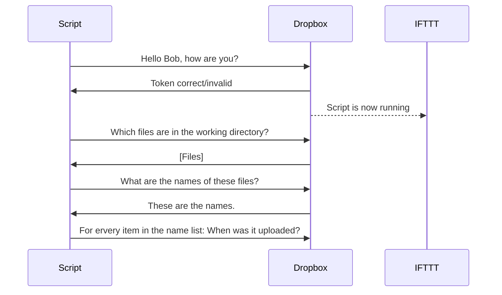
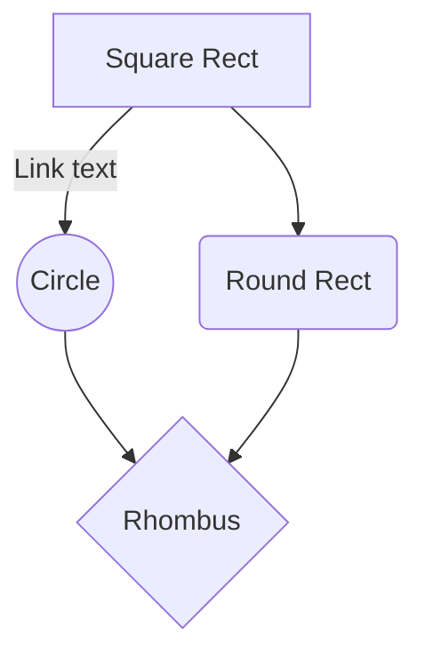

# Hi, there!

Hi, I'm Felix. I automated my routine of scanning my documents, bills, etc. and archiving them onto my NAS. For this workflow I needed a script that automatically deletes all old files from my Dropbox. Of course there is a quite popular website which can do this for you, but they charge around 20 $/year for there minimum service. So I decided to make my own little Python Script doing that Job for me on my Raspberry Pi.

# What does this script do?

 - delete all files in a specified location, which are older than x days
 - *send notifications through IFTTT when the script runs and whenever a file gets deleted*

   

> Points written in *italian* are optional features.

# Installation

 1. Clone this repository onto your computer.
  `git clone https://github.com/felixwttr/Dropbox_auto_deletion.git`
2. Change into the projects directory
	`cd Dropbox_auto_deltion`
3. Install all required packages through pip
	Linux/Mac: `pip3 install -r requirements.txt`
	Windows:   `pip install -r requirements.txt`
4. Edit the variables to fit your pupose
	`age_of_files = 30  # at which age files should be deleted?`
	`working_dir = '/<observed_dir>/'  # which folder should be observed?`
	`ifttt_integration = True  # do you wish to get an notification through IFTTT whenever a file gets deleted?`
	`logging = True  # do you want to have a log file with every action this skript does to your files?`
	`run_ifttt_webhook_name = 'run_dropbox_automatic_deletion'  # Name of your Webhook for notification whenever the scrips runs`
	`deleted_ifttt_webhook_name = 'file_deleted'  # Name of your Webhook for notification whenever a file gets deleted`
5. The last Step is to edit the `.env` file. In this file you have to safe your Token for Dropbox and your Webhook Key for IFTTT.
You don't have those? I'll show you how to get one.

## Run this script automatically on your Raspberry Pi or any other Linux or macOS System

 1. Do all the steps from **Installation**.
 2. Change into the projects directory.
 `cd <path-to-project>/`
 3. Run command `pwd` and copy the the full path
 4. run command `crontab -e` and choose a standard editor if you didn't have set it before *(I would recommend nano because I think it's the easiest)*
 5. Move to the bottom of the file and insert this line:
 `0 9 * * 1 /usr/bin/python3 /<path-to-project/Dropbox_auto_deletion.py`
 This example line runs the script every Monday at 09:00 AM, but you can change to whatever you want. A little helper is this site [Crontab Guru](https://crontab.guru) as it helps getting the right schedule expression.
 6. After inserting the correct line just hit **control + O** and then **control + X**.

Now your script runs automatically on the schedule you just set.

# How to get those Tokens and Keys?

### Dropbox
 1. Visit this site ([DropBox - Create an App](https://www.dropbox.com/developers/apps/create)) and log in with your dropbox credentials
 2. Choose "**Scoped Access**" as API
 3. As type of access choose "**Full Dropbox**"
 4. Give your app a telling name and click on "**Create APP**"
 5. In the upcoming page change to the "**Permissions**" tab and give permissions for the following options and **Submit** your changes
	 - files.metadata.write
	 - files.content.write
	 - files.content.read
6. Go back into the **Settings** tab and search for the **OAuth 2** section.
7. Set the **Access token expiration** to **No Expiration**
8. Click on "**Generate**".

This is your Dropbox Token which needs to be copied into the `.env` file.

### IFTTT (optional)
1. Visit [Webhooks Status Page](https://ifttt.com/maker_webhooks/) and log in with your IFTTT credentials.
2. Click on "**Settings**".
3. The URL next to "URL Status" contains your Webhook Key. It's the last section.
`https://maker.ifttt.com/use/<your_Webhook_key>`

Copy this key into the `.env` file if you want IFTTT notifications

# How does the script work?

You can render UML diagrams using [Mermaid](https://mermaidjs.github.io/). For example, this will produce a sequence diagram:

And this will produce a flow chart:

